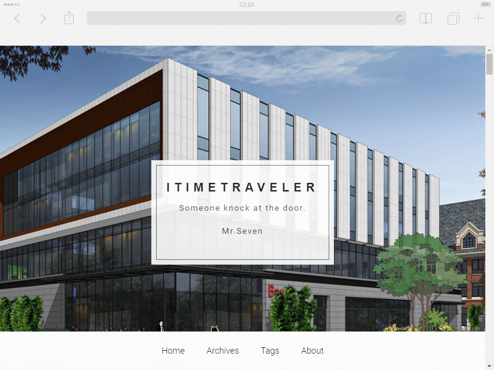
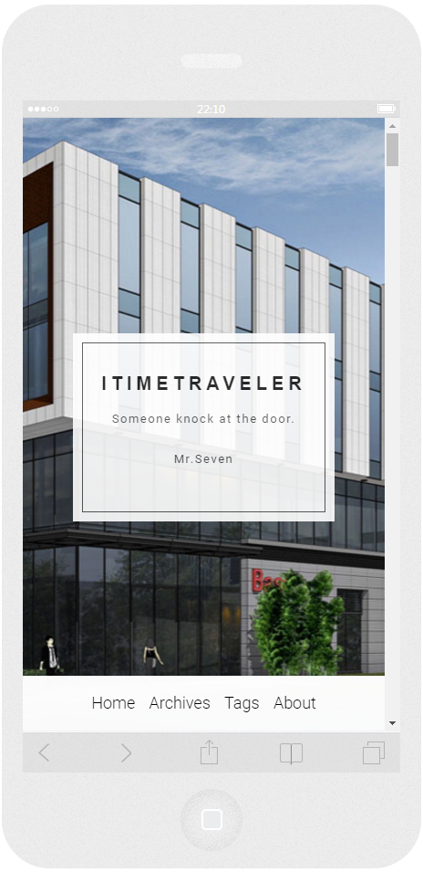

# Hiker

[](https://travis-ci.org/iTimeTraveler/hexo-theme-hiker)		[](https://github.com/iTimeTraveler/hexo-theme-hiker/blob/master/LICENSE)


An attractive theme for [Hexo]. I call it "Hiker", short for "HikerNews".

[**Live Preview**](https://itimetraveler.github.io/) | [**Hiker 中文版使用文档**](README.cn.md)




> **Hiker requires Hexo 2.4 and above.**

## Installation

 1. Get it from GitHub

 ```shell
 $ git clone https://github.com/iTimeTraveler/hexo-theme-hiker.git themes/hiker
 ```
 2. Enable

 Modify `theme` setting in `_config.yml` to `hiker`.
 ```
 # Extensions
 ## Plugins: http://hexo.io/plugins/
 ## Themes: http://hexo.io/themes/
 theme: hiker
 ```
 3. Update

 ```shell
 $ cd themes/Hiker
 $ git pull
 ```

## Configuration

``` yml
# ---------------------------------------------------------------
# Site Information Settings
# ---------------------------------------------------------------

# Header Menu
menu:
  Home: /
  Archives: /archives
  Tags: /tags
  About: /about
rss: /atom.xml

since: 2013

# Put your favicon.ico into `hexo-site/themes/hiker/source/` directory.
avatar: css/images/mylogo.jpg


# Homepage
# eg. home_background_image: css/images/home-bg.jpg
home_background_image: css/images/home-bg.jpg
home_logo_image: 
  enable: false
  border: false
  url: css/images/homelogo.jpg


# AboutPage background
about_big_image: css/images/pose.jpg


# Content
excerpt_link: Read More
fancybox: true


# Sidebar
sidebar: right
widgets:
- category
- tag
- tagcloud
- archive
- recent_posts


# Duoshuo ShortName
duoshuo_shortname: iTimeTraveler


# Code Highlight theme
# Available value:
#    default | normal | night | night eighties | night blue | night bright
# https://github.com/chriskempson/tomorrow-theme
highlight_theme: default


# Article theme color
# Available value:
#    random | orange | blue | red | green | black
theme_color: random


# display widgets at the bottom of index pages (pagination == 2)
index_widgets:
# - category
# - tagcloud
# - archive


# widget behavior
archive_type: 'monthly'
show_count: true


# Miscellaneous
google_analytics:
gauges_analytics:
twitter:
google_plus:
fb_admins:
fb_app_id:

```

- **menu** - Navigation menu
- **rss** - RSS link
- **excerpt_link** - "Read More" link at the bottom of excerpted articles. `false` to hide the link.
- **fancybox** - Enable [Fancybox]
- **sidebar** - Sidebar style. You can choose `left`, `right`, `bottom` or `false`.
- **widgets** - Widgets displaying in sidebar
- **google_analytics** - Google Analytics ID
- **favicon** - Favicon path
- **twitter** - Twiiter ID
- **google_plus** - Google+ ID

## Features

### Code Highlight Theme

Hiker use [Tomorrow Theme](https://github.com/chriskempson/tomorrow-theme) for your code block. We have six options in total: `default`, `normal`, `night`, `night blue`, `night bright`, `night eighties`


Modify `highlight_theme` in hiker/_config.yml.

```yml
# Code Highlight theme
# Available value:
#    default | normal | night | night eighties | night blue | night bright
# https://github.com/chriskempson/tomorrow-theme
highlight_theme: default
```

### Blog Theme Color

Hiker provide five color themes for your blog.
- <p><span style="display: inline-block; width: 18px; height: 18px; margin: 0 4px; background-color: #fb6d19; border-radius: 3px; vertical-align: middle;"></span> orange</p>
- <p><span style="display: inline-block; width: 18px; height: 18px; margin: 0 4px; background-color: #00aced; border-radius: 3px; vertical-align: middle;"></span>blue</p>
- <span style="display: inline-block; width: 18px; height: 18px; margin: 0 4px; background-color: #f03838; border-radius: 3px; vertical-align: middle;"></span> red
- <span style="display: inline-block; width: 18px; height: 18px; margin: 0 4px; background-color: #39aa56; border-radius: 3px; vertical-align: middle;"></span> green
- <div style="display: inline-block; width: 18px; height: 18px; margin: 0 4px; background-color: #404040; border-radius: 3px; vertical-align: middle;">xx</div> black

You can modify `theme_color` in hiker/_config.yml.

```yml
# Article theme color
# Available value:
#    random | orange | blue | red | green | black
theme_color: random
```

### Fancybox

Hiker uses [Fancybox] to showcase your photos. You can use Markdown syntax or fancybox tag plugin to add your photos.

```



```

### Sidebar

You can put your sidebar in left side, right side or bottom of your site by editing `sidebar` setting.
Hiker provides 5 built-in widgets:

- category
- tag
- tagcloud
- archives
- recent_posts

All of them are enabled by default. You can edit them in `widget` setting.

### Comment support

Hiker has native support for DuoShuo comment systems. Add the following snippets to hiker `hiker/_config.yml`:

```yml
# Duoshuo ShortName
duoshuo_shortname: iTimeTraveler
```

## Contributing

All kinds of contributions (enhancements, new features, documentation & code improvements, issues & bugs reporting) are welcome.

Looking forward to your pull request.

[Hexo]: https://hexo.io/
[Fancybox]: http://fancyapps.com/fancybox/
[Font Awesome]: http://fontawesome.io/